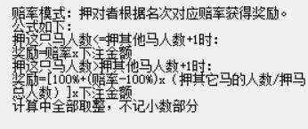

## 抄作业

### 命令
- 赛马：启动赛马
- 押马x#y
- 出来结果直接结束比赛
- 同时到达终点
- 救济金

### 商品

- 巧克力：60%马多走一格
- 兴奋剂：60%三格 20%回到原点
- 香蕉皮：30%滑倒 下一步0格
- 祈祷：5%直接10格
直接使用，无需提前购买
没指定就直接随机
效果可累加

### 赛马大数据

- 最赚钱的🐎
- 最赔钱的🐎
- 最有钱的人
- 运气最好的人

### 玩法

### 特点

- 超真实的经济系统(采用美元通用货币)
- 超逼真的游戏画面(采用emoji)
- 超多样的事件系统
- 超真实的皇家赌场计算系统